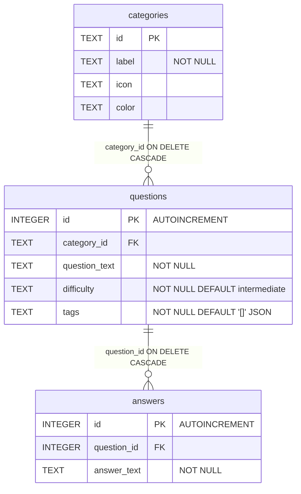

# Architecture

Data model, request lifecycle and design decisions for the Arabic Interview Guide. For feature detail see [FEATURES.md](FEATURES.md); for the skills this demonstrates see [SKILLS.md](SKILLS.md).

## System shape

A two-service application with a clear network boundary and no shared runtime state.

```text
┌────────────────────────────┐         ┌──────────────────────────────┐
│  frontend  (Vite dev :5173)│  HTTP   │  backend  (Express :3000)    │
│                            │────────▶│                              │
│  React 18 + TypeScript     │  /api/* │  CORS enabled, JSON bodies   │
│  hooks ──▶ typed client    │         │                              │
│  renders RTL, paginated    │         │  ┌────────────────────────┐  │
└────────────────────────────┘         │  │ routes ──▶ openapi.json│  │
                                       │  └───────────┬────────────┘  │
                                       │              │               │
                                       │        ┌─────▼──────┐        │
                                       │        │ migrations  │        │
                                       │        └─────┬──────┘        │
                                       │              │               │
                                       │         ┌────▼─────┐         │
                                       │         │  SQLite  │         │
                                       │         │  (file)  │         │
                                       │         └──────────┘         │
                                       └──────────────────────────────┘
```

The frontend never talks to the database, and the API holds no UI concerns. Either side can be replaced without touching the other, as long as the OpenAPI contract holds.

## Data model

### Current table definitions

The live schema, as produced by the migrations in `backend/src/db/migrations/`:

```sql
CREATE TABLE categories (
  id    TEXT PRIMARY KEY,
  label TEXT NOT NULL,
  icon  TEXT,
  color TEXT
);

CREATE TABLE questions (
  id            INTEGER PRIMARY KEY AUTOINCREMENT,
  category_id   TEXT NOT NULL,
  question_text TEXT NOT NULL,
  difficulty    TEXT NOT NULL DEFAULT 'intermediate',
  tags          TEXT NOT NULL DEFAULT '[]',
  FOREIGN KEY (category_id) REFERENCES categories (id) ON DELETE CASCADE
);

CREATE TABLE answers (
  id          INTEGER PRIMARY KEY AUTOINCREMENT,
  question_id INTEGER NOT NULL,
  answer_text TEXT NOT NULL,
  FOREIGN KEY (question_id) REFERENCES questions (id) ON DELETE CASCADE
);

CREATE INDEX idx_questions_category_id      ON questions(category_id);
CREATE INDEX idx_questions_category_created ON questions(category_id, id);
CREATE INDEX idx_answers_question_id        ON answers(question_id);
```



Design points:

- **Category ids are caller-supplied text slugs** (`laravel-core`, `devops`, `databases`), stable across environments and readable in URLs.
- **Questions and answers use surrogate integer keys.** Their natural content is unbounded prose, so a content-based key would be impractical.
- **`answer_text` is plain text, not HTML.** The UI renders it inside a `<pre>` with `white-space: pre-wrap`, which preserves multi-line formatting without a markdown library and without an HTML injection surface.
- **`difficulty` is a `TEXT` column with a NOT NULL default** rather than a native enum, because SQLite has no enum type. Valid values are `beginner | intermediate | advanced`; the seed script normalises anything else to `intermediate`.
- **`tags` is JSON-encoded `TEXT`, not a join table.** The tag set is a short, read-only, always-fetched-with-its-question list. A separate `tags` table plus join rows would cost an extra join on every read and buy nothing, because nothing queries by tag.
- **No `created_at` / `updated_at` columns.** Deliberate: the app has no chronological UI, and the omission keeps the write paths minimal. Ordering everywhere is by `id`.
- **`PRAGMA foreign_keys = ON` is set per connection** because SQLite disables foreign key enforcement by default; without it `ON DELETE CASCADE` silently does nothing.

### The two full-text index tables

```sql
CREATE VIRTUAL TABLE search_questions USING fts5(
  question_text,
  tokenize = 'unicode61 remove_diacritics 2'
);

CREATE VIRTUAL TABLE search_answers USING fts5(
  answer_text,
  tokenize = 'unicode61 remove_diacritics 2'
);
```

They are not base tables. `search_questions.rowid` is kept equal to `questions.id` and `search_answers.rowid` to `answers.id`, and six triggers (`*_ai`, `*_au`, `*_ad` on each base table) keep them in step with every insert, update and delete. The design rationale is in [Search design](#search-design-fts5) below.

### Indexes: what they were worth

Before migration 003 there were no indexes on any foreign key column. SQLite does not create them automatically — only `INTEGER PRIMARY KEY` is implicitly indexed, as the rowid alias. That left two of the three hottest read paths as full table scans:

| Query | Before | After (actual plan) |
| --- | --- | --- |
| `SELECT * FROM questions WHERE category_id = ?` | `SCAN questions` | `SEARCH questions USING INDEX idx_questions_category_created (category_id=?)` |
| `SELECT * FROM answers WHERE question_id = ?` | `SCAN answers` | `SEARCH answers USING INDEX idx_answers_question_id (question_id=?)` |
| Filter by category, ordered by id (the list endpoint's id page) | scan plus a sort | `SEARCH questions USING COVERING INDEX idx_questions_category_id (category_id=?)` |

`idx_questions_category_created` exists because the list path filters on `category_id` and orders by `id`; a composite index lets the planner satisfy both from the index without a separate sort step. SQLite's cost model picks between the two `category_id` indexes per query — the composite one for a plain `SELECT *`, the single-column one as a covering index when the query only needs `id` — which is why the test accepts either rather than pinning a name.
`backend/test/api.test.js:110-117`

This is not asserted on faith. `backend/test/api.test.js` reads the index names back out of `sqlite_master` and then runs `EXPLAIN QUERY PLAN` on both predicates, asserting the plan mentions an index and does not regress to `SCAN questions`. Drop one of these indexes and the suite fails, which is the point: the claim "this is indexed" is enforced rather than remembered.

### Content

| Measure | Value |
| --- | --- |
| Categories | 10 |
| Questions | 113 |
| Answers | 296 |
| Questions with more than one answer | 46 |
| Distinct tags in use | 124 |
| Difficulty spread | 21 beginner / 58 intermediate / 34 advanced |

`backend/src/data.json` holds all of it, in Arabic, with `difficulty` and `tags` on every question. Two categories are new since the previous revision (Docker & DevOps, Databases & SQL), and System Design, Testing & Security and Laravel Advanced were rebalanced from 3/3/5 questions to 11 each so no category is a token stub.

## Schema evolution

The schema is created and changed by **versioned migrations**, not a hardcoded `CREATE TABLE` blob in application code.

`backend/src/db/migrate.js` is the runner:

1. Ensures `schema_migrations (version TEXT PRIMARY KEY, applied_at TEXT NOT NULL DEFAULT (datetime('now')))` exists.
2. Reads the applied versions and lists `backend/src/db/migrations/*.js`, sorted by filename.
3. Treats the filename without its extension as the version, so a migration cannot be silently renumbered into a different identity.
4. Imports each pending file and runs its exported `up(ctx)` inside `BEGIN` … `COMMIT`, inserting the version row **in the same transaction**. A failure rolls back that migration, aborts the run, and rethrows with the failing version named. The database is never left half-migrated.

Migrations are handed `{ run, get, all }` promisified helpers rather than the raw `sqlite3` handle, so they read as plain sequential SQL and need no callback boilerplate.

```text
001-initial-schema     categories, questions, answers — the original schema, kept
                       byte-for-byte so databases created by earlier versions of
                       the app migrate cleanly (all CREATE ... IF NOT EXISTS)
002-question-metadata  difficulty + tags via ALTER TABLE ADD COLUMN, guarded by a
                       PRAGMA table_info check so it is safe to re-run; existing
                       rows backfill from the column defaults
003-performance-indexes the three indexes above
004-full-text-search    the two FTS5 tables, six triggers, and a backfill of any
                       rows that predate the index
```

`002` uses `PRAGMA table_info(questions)` to check for the column before adding it. SQLite has no `ADD COLUMN IF NOT EXISTS`, and a bare `ALTER TABLE` on an existing column raises "duplicate column name"; the check makes the migration idempotent in the same spirit as the `IF NOT EXISTS` in `001`.

## Request lifecycle

### Startup ordering

`backend/src/database.js` opens the database, enables foreign keys, runs migrations, then bootstraps starter categories, and only then resolves the exported `ready` promise. `server.js` awaits `ready` before `app.listen`, so no request can arrive before the schema exists — and, for a fresh clone, before the categories are in place. The port is bound only when `server.js` is executed directly; the test suite imports the app and drives it in-process.

### Read path

```text
App.tsx (composition root)
  └─ useCategories()  ──▶ GET /api/categories  ──▶ GROUP BY with COUNT(q.id)
     useStats()       ──▶ GET /api/stats       ──▶ totals + per-category counts
     useQuestions()   ──▶ GET /api/questions   ──▶ page of ids, then hydrate
                          or GET /api/search   ──▶ FTS5 merge, page of ids, hydrate
```

`useQuestions` picks the endpoint: a non-empty `searchTerm` goes to `/api/search` (across every category), otherwise `category` is applied server-side. Every one of these returns data the UI renders directly; the envelope is passed through untouched so pagination state is driven by server-computed `total` and `pages`.

### Write path

```text
user submits form
  └─ POST or PUT with JSON body
       ├─ validate required fields ──(fail)──▶ 400 { error }
       ├─ BEGIN TRANSACTION
       │    ├─ INSERT/UPDATE question
       │    ├─ DELETE previous answers   (only when an answers array is supplied)
       │    ├─ INSERT per answer        (FTS trigger fires with each one)
       │    └─ any failure ──▶ ROLLBACK ──▶ 500 { error }
       └─ COMMIT ──▶ 201 { id, message } on create, 200 { message } on update
  └─ client catches, shows the server's error, keeps the form open, or reloads
```

`PUT /api/questions/:id` treats a supplied `answers` array as the **complete desired set**: the previous rows are deleted and the new ones inserted inside the same transaction. Omitting `answers` leaves them untouched. Replace-not-patch for a child collection is simpler and safer than diffing, and it is why the individual answer endpoints are not used by the UI.

The same presence semantics apply to the parent's own optional fields, because a caller patching one field should not clobber the rest. `difficulty` and `tags` are `undefined` when the key is absent, and `updateQuestion` builds its `SET` clause from the keys that are actually present. This was a real inconsistency for a while: `answers` honoured "absent means unchanged" while `tags` was defaulted to `[]` and `difficulty` to `intermediate`, so a text-only edit silently wiped a question's metadata. An explicit `[]` still clears tags, and an explicit unknown `difficulty` still normalises to `intermediate`, so the two are distinguishable in both directions.

`POST /api/questions` also accepts `answers` as either plain strings or `{ answer_text }` objects, which is the same shape the seed file uses.

## Search design (FTS5)

### Why two virtual tables

The obvious design is one FTS table per question holding the question text concatenated with all of its answers, kept current by an `AFTER UPDATE` trigger on `questions`. That design does not work in SQLite, and the reason is a specific SQL limitation: **a trigger body may not contain a subquery.** Recomputing a question's concatenated answer text needs exactly that:

```sql
-- Not expressible: "near syntax error" in a trigger body
CREATE TRIGGER questions_reindex AFTER UPDATE ON questions
BEGIN
  UPDATE search_questions SET body =
    new.question_text || ' ' ||
    (SELECT group_concat(answer_text) FROM answers WHERE question_id = new.id);
END;
```

So instead of one table indexed by question, each base row is indexed individually: `search_questions` keyed on `questions.id`, `search_answers` keyed on `answers.id`. Every trigger is then a single-row statement (`INSERT INTO search_answers (rowid, answer_text) VALUES (new.id, new.answer_text)`), and the two result sets are merged in the search query instead of at write time. The cost is a slightly more involved read query; the benefit is that the index can never drift out of sync, because the database maintains it.

### Merging the two result sets

`backend/src/search.js` builds one CTE and reuses it for the count and for the page:

```sql
WITH question_hits AS (
  SELECT rowid AS id, bm25(search_questions) AS rank, 0 AS source
    FROM search_questions
   WHERE search_questions MATCH ?
),
answer_hits AS (
  SELECT a.question_id AS id, bm25(search_answers) AS rank, 1 AS source
    FROM search_answers s
    JOIN answers a ON a.id = s.rowid
   WHERE search_answers MATCH ?
),
hits AS (
  SELECT id, MIN(rank) AS rank, MIN(source) AS source
    FROM (SELECT * FROM question_hits UNION ALL SELECT * FROM answer_hits)
   GROUP BY id
)
SELECT q.id FROM hits JOIN questions q ON q.id = hits.id
 ORDER BY hits.source, hits.rank, q.id
 LIMIT ? OFFSET ?
```

- `source` is `0` when the question's own text matched and `1` when only an answer did. Ordering by `source` first means a question that matched directly always outranks one that matched only because of an answer — which is what a user searching for a question expects.
- `bm25()` supplies relevance within each group. Its values are negative and lower is better, so `MIN(rank)` keeps the best-scoring hit per question rather than letting a question be represented once per matching answer.
- `MIN(source)` is safe for the same reason the ordering is: `0` (question text) always sorts before `1` (answer only), so a question that matched both keeps `source = 0`.
- `a.question_id` is what maps an answer hit back to a question; the FTS rowid alone is the answer's own id.

### Tokenizer

`tokenize = 'unicode61 remove_diacritics 2'`.

- `unicode61` classifies letters and digits as token characters using Unicode categories, so Arabic is indexed and matched without writing a custom tokenizer.
- `remove_diacritics 2` folds Latin accents, so `café` matches `cafe`. It does **not** strip Arabic tashkeel or tatweel: `الخدمة` and `الـخدمة` are stored as two distinct tokens, verified against `fts5vocab`. Matching is token-level with no stemming, so inflected forms of one root also remain distinct.

### Query sanitization

This is a security property, not tidiness. FTS5 treats `"`, `*`, `^`, `NEAR`, `OR`, `AND` and parentheses as query syntax. Raw user input handed to `MATCH` produces `500`s on unbalanced quotes, and — worse — lets a crafted term smuggle operators into the query.

`buildMatchQuery` therefore:

1. Replaces every character that is not a letter or digit (`\p{L}` / `\p{N}`) with a space. This is what removes `"`, `*`, `^`, `-`, `.`, `(` and `)`.
2. Splits on whitespace, drops empties, and caps the result at 8 tokens.
3. Wraps each token in double quotes, which makes it an inert string literal rather than a syntax fragment.
4. Appends `*` to the **last** token only, so results narrow as the user types without every token becoming a prefix match.
5. Joins with `AND`.

```text
" OR 1=1 --"   →  tokens ["OR", "1", "1"]  →  "OR" AND "1" AND "1"*
"cont"         →  "cont"*
service container →  "service" AND "container"*
```

It returns `null` when nothing searchable remains, which the caller turns into an empty result set rather than an error. The test suite runs a table of FTS5 operators — `"`, `NEAR`, `*`, `container^`, `a OR`, `(((` — through the endpoint and asserts each returns `200` with a well-formed envelope, plus a case asserting an injection attempt does not return the whole corpus.

### AND first, then OR

Multi-word queries are ANDed, because "service container" should not match a question that only mentions "service".

Arabic breaks that assumption. The definite article is written attached to the word, so a user typing "ال container" produces the token `ال`, which matches nothing in the corpus. The AND query therefore returns zero rows for a query the user plainly intended. So when the AND attempt yields nothing and the expression actually contains `AND`, the query is retried with the operators replaced by `OR`:

```js
if (countRows[0].count === 0 && expression.includes(" AND ")) {
  expression = expression.replaceAll(" AND ", " OR ");
  countRows = await all(TOTAL_SQL, [expression, expression]);
}
```

A two-round trip is accepted here because the fallback only fires on an empty result, which is the rare case. There is a regression test for it (`multi-token query prefers AND before falling back to OR`).

### Paginate, then hydrate

The hydration query fans each question out to one row per answer:

```sql
SELECT q.id, ..., a.id AS answer_id, a.answer_text
  FROM questions q
  JOIN categories c ON c.id = q.category_id
  LEFT JOIN answers a ON a.question_id = q.id
 WHERE q.id IN (?, ?, ...)
 ORDER BY q.id, a.id
```

Applying `LIMIT`/`OFFSET` to *that* query is the classic pagination bug: the limit would count joined rows, not questions, so a page size of 20 against questions averaging three answers each returns as few as seven questions, and `total` from a separate `COUNT(*)` would disagree with what a client actually received. The same trap exists on the id page in search, where a question can match on several answers.

Both endpoints therefore page the **question ids** first and hydrate exactly those ids in a second statement. `hydrateSql(count)` builds its placeholder list from the actual id count rather than padding to a fixed width, so a one-row page sends one `?`. `groupRows` then collapses the flat rows back into the nested shape using a `Map`, so the client still gets one object per question with an `answers` array.

The same pattern is applied to `GET /api/questions` (`server.js:189-201`), and `backend/test/api.test.js:684-715` is the regression test: three questions with three, two and one answers, page size 2, asserting the first page holds two questions, the second holds one, `total` is 3, and the pages do not overlap.

### Filters and the count/page invariant

`listQuestions` collects predicates into a list and joins them, rather than hard-coding one filter per query. That is what keeps the count and the id page derived from the same fragment, so `total` cannot drift from the items returned as filters are added. `difficulty` is the second predicate and is combined with `category` with `AND`.

`difficulty` is validated once, at the edge, by `parseDifficultyFilter` in `validate.js`: a recognised level is returned, and anything else becomes `null`, which means no filter. Coercing an unknown value to a level would be actively harmful — `?difficulty=expert` would silently show only intermediate questions — so the parameter is ignored and the unfiltered list comes back. This mirrors how `parsePagination` treats junk input: fall back rather than error, and never invent a filter the caller did not ask for.

Search applies the same predicate to both statements, and the predicate has to be spliced in *before* `ORDER BY`, which is why `totalSql` and `pageIdsSql` in `search.js` are functions taking the fragment rather than template strings. A count that ignored the filter would overstate `total`; a page that ignored it would list items the count does not account for. Either way the pagination controls describe a set the user is not looking at.

## API surface

15 routes: health, statistics, the OpenAPI spec, the three resources and search. Swagger UI is additionally mounted at `/api/docs`. Full reference with examples in [FEATURES.md](FEATURES.md#api-reference).

```text
GET    /api/health
GET    /api/stats                totals + per-category counts, one request
GET    /api/docs                 Swagger UI
GET    /api/openapi.json         OpenAPI 3.0 spec

GET    /api/categories           includes question_count per category
POST   /api/categories
PUT    /api/categories/:id
DELETE /api/categories/:id

GET    /api/questions[?category=<id>&difficulty=&page=&limit=]
POST   /api/questions
PUT    /api/questions/:id
DELETE /api/questions/:id

GET    /api/search?q=<term>&difficulty=&page=&limit=

GET    /api/answers/:questionId
PUT    /api/answers/:id
DELETE /api/answers/:id
```

### Pagination envelope

`GET /api/questions` and `GET /api/search` both answer with:

```json
{
  "items": [],
  "total": 113,
  "page": 1,
  "limit": 20,
  "pages": 6
}
```

`total` counts the whole match set, not the page. Including it means the client can render pagination controls from the response it already has, with no second request to count. `page` is 1-based; `limit` defaults to 20 and is clamped to 1..100. Invalid input falls back rather than erroring — `?limit=abc` gives 20, `?page=xyz` gives 1 — so a hand-edited or stale link still renders something useful instead of a `400`.

`GET /api/stats` returns the site-wide totals and the per-category breakdown in one response, which is what the header summary renders without a second request; `GET /api/categories` carries `question_count` per row, which is what the tab badges render.

Creates return **201** with the new id; updates and deletes return **200**.

The specification is a committed file (`backend/src/openapi.json`) rather than annotations in the route handlers, so the contract is reviewable in a pull request and diffable over time. `server.js` reads it once at startup and serves it both raw and through Swagger UI.

## Error handling

- Every API failure returns `{ "error": "..." }`. Validation failures are `400`, missing records `404`, database failures `500`.
- Updates and deletes inspect `this.changes` and return `404` rather than reporting success on a no-op.
- On the client, `request()` in `api/client.ts` throws an `ApiError` carrying the HTTP status and the server's message, so `try`/`catch` in the component replaces the old `response.ok` checks.
- The error banner has a retry control wired to each hook's `reload`, and a dismiss control. Failed saves keep the form open, so no input is lost.

## Frontend architecture

`App.tsx` is a **composition root** at 334 lines, down from ~781. It holds view state and wires things together; it does not fetch, format or render data structures itself.

```text
api/types.ts        wire types — snake_case, mirroring the JSON exactly
api/client.ts       typed fetch; throws ApiError; accepts an AbortSignal
hooks/useResource   generic load / error / reload primitive
  ├── useCategories  GET /api/categories
  ├── useStats       GET /api/stats
  └── useQuestions   GET /api/questions or GET /api/search, paginated
hooks/useDebounce   generic value + delay
components/*        presentational only (15): Header, StatsBar, SearchBar,
                    DifficultyFilter, CategoryTabs, QuestionList, QuestionCard,
                    QuestionForm, CategoryForm, Modal, Pagination, ErrorBanner,
                    Footer, LoadingScreen, ManageToolbar
```

The rule is that components receive data and callbacks as props and own no fetching. State that is derived — the active category when the selected one has been deleted, the theme object — is computed with `useMemo` during render rather than stored, so it cannot drift.

### `useQuestions`: endpoint selection, debouncing, and cancellation

```ts
const term = searchTerm.trim();
const request = term
  ? searchQuestions({ term, difficulty, page, limit, signal: controller.signal })
  : fetchQuestions({ category, difficulty, page, limit, signal: controller.signal });
```

`difficulty` is forwarded to both endpoints and is listed in the effect's dependency array, so changing it re-requests. It is deliberately *not* dropped during a search: the search endpoint ignores `category` and spans every category, so dropping the difficulty filter there would make it silently stop applying while the control still looked active.

Each render's effect creates a fresh `AbortController` and returns a cleanup that sets a local `active` flag to `false` and calls `controller.abort()`. This closes a real race: a fast typist produces overlapping requests, and without cancellation the slow first response can resolve *after* the fast second one and overwrite the newer results with stale ones. Two independent guards prevent that — the aborted `fetch` rejects, and even if a response were already in flight the `active` check means it is never committed. The tests pin this (`aborts a stale request and keeps the newest results`) by holding one response open, issuing a newer query, and asserting the first request's `signal.aborted` is `true` and that the late response does not change the rendered state.

`page` and `limit` in the returned object echo the *request* rather than the response, so the pagination controls react to a click immediately instead of waiting for the next page to land. `searchPending` in `App.tsx` compares the raw term to the debounced one, which is what keeps the result count from showing stale totals mid-typing.

## Testing and CI

**Backend — 72 tests, 9 suites** (`node:test` + Supertest) drive the real exported Express app in-process against a temporary SQLite file. No mocked database: real SQL, real migrations, real transactions, real cascades. Isolation comes from `DB_PATH`, set before the app is imported; the temp directory is removed afterwards. Coverage worth naming:

| Area | What is asserted |
| --- | --- |
| Migrations | exactly 4 versions in `schema_migrations`, in order |
| Indexes | the three names present in `sqlite_master` |
| Query plans | `EXPLAIN QUERY PLAN` uses an index for `category_id` and for `question_id`, and does not fall back to a scan |
| Pagination | envelope fields, page splitting, clamping (`limit=9999` → 100, `limit=0` → 1), non-numeric input, no overlap between pages |
| Search | Arabic terms, prefix match, answer-only match, AND-then-OR fallback, nested hydration shape, FTS operator sanitization |
| Difficulty filter | one level at a time; category and difficulty combined; the three levels partition a category exactly; `total` and `pages` stay consistent across every page; a page past the end still reports the real total; the filter survives the AND-then-OR retry |
| Unknown filter values | `?difficulty=expert` returns the unfiltered list rather than being coerced to a level |
| Transactions | a create whose category does not exist leaves the question count unchanged |
| Cascades | deleting a category removes its questions and their answers; deleting a question removes its answers |
| CRUD | full lifecycle per resource, `201` on create, `404` on no-op update/delete, `400` on missing fields |
| Input normalisation | unknown `difficulty` falls back to `intermediate`; tags are trimmed, slugged, de-duplicated and capped at 6; blank answers are dropped |
| Partial updates | omitting `answers`, `tags` or `difficulty` keeps the stored value, while an explicit `[]` clears tags or answers |

**Frontend — 63 tests** across three files (Vitest + jsdom, Testing Library). 53 of them live in `App.test.tsx`, which renders the real `App` with `fetch` stubbed to deterministic fixtures and asserts through `getByRole`, `getByLabelText` and `getByTestId`, so the suite doubles as an accessibility check. Four cover `useDebounce` directly via `renderHook`, and six cover `withAlpha` in `theme.test.ts`. `cleanup` and mock restoration run in `src/test/setup.ts` after every test.

**Two frontend regressions worth naming, because both were invisible in the browser output.**

*The tag pill had no border in dark mode.* Components tinted a colour by appending alpha digits to the hex string (`` `${theme.mutedText}44` ``). That is only safe for 6-digit hex. The dark muted colour is the 3-digit shorthand `#666`, so the concatenation produced `#66644` — five hex digits, an invalid colour. Browsers and jsdom both discard an invalid colour, and because it was the only value in the `border` shorthand, the entire declaration vanished and the pill rendered with no border at all. `withAlpha` in `theme.ts` now expands 3-digit shorthand to 6 digits before appending, so the result is always a valid 8-digit `#rrggbbaa`, and passes non-hex values such as `transparent` and `rgb(...)` through untouched. `theme.test.ts` asserts that every theme field in both modes stays a valid hex colour, which is the check that would have caught it.

*The same pill also mixed CSS shorthand and longhand.* It spread `badgeStyle` — which sets the `border` shorthand — and then overrode only `borderStyle`. React warns whenever a style update mixes the two, and the surviving declaration depends on property order. Writing the whole border in one shorthand removed the warning. The assertion reads the serialised `style` attribute rather than `el.style`, because jsdom normalises an 8-digit hex to `rgba()`, and a `border` shorthand containing a dropped colour is exactly the failure being guarded against.

*`WHERE` cannot be appended to a query that already ends in `ORDER BY`.* The difficulty filter is spliced into the search SQL, and the first version appended the predicate to the end of both statements. The count query has no `ORDER BY`, so it worked; the page query does, so `?difficulty=` returned `500 SQLITE_ERROR: near "WHERE": syntax error` on every filtered search. Only a filter combined with a search exposed it, since browsing never touches that query. `totalSql` and `pageIdsSql` are now functions that place the predicate before the `ORDER BY`, and `backend/test/api.test.js` filters a search by each of the three levels, which fails loudly if the clause lands in the wrong place again.

*The same reasoning applies to the count.* Filtering the page but not the count undercounts `total`; filtering the count but not the page lists items the total does not account for. Both directions make the pagination controls lie. The tests assert that the three difficulty totals sum to the unfiltered total, which only holds if the page and the count are filtered identically.

**A testing gotcha worth recording.** `userEvent` deadlocks under Vitest fake timers: Testing Library's async wrapper awaits its own work, and that only advances Jest's clock, so the awaited interaction never resolves. Debounce behaviour is therefore tested by driving a `fireEvent.change` burst (`"e"`, `"ev"`, `"event loop"`) and asserting at the debounce boundary — no request at `DEBOUNCE_MS - 1`, exactly one request for the final value after `+1`. `userEvent` is still used everywhere real timers are in play.

**CI** (`.github/workflows/ci.yml`):

| Job | Steps |
| --- | --- |
| `backend` (Node 20 and 22, `fail-fast: false`) | `npm ci` → `npm audit --audit-level=high` → `npm test` |
| `frontend` (Node 20) | `npm ci` → `npm audit --audit-level=high` → `npm run lint` → `npx tsc --noEmit` → `npm test` → `npm run build` |

Both jobs cache npm with `cache-dependency-path` pointing at their own lockfile. The Node matrix exists because FTS5 availability and the `sqlite3` native build differ across majors. A `concurrency` group of `ci-${{ github.ref }}` with `cancel-in-progress: true` cancels superseded runs on the same branch instead of queueing them. `--audit-level=high` gates the build, so a new high-severity advisory fails CI rather than being noticed later.

## Seeding strategy

Two distinct mechanisms, deliberately separated:

| Mechanism | File | Behaviour |
| --- | --- | --- |
| Schema | `backend/src/db/migrations/*.js` | Versioned, tracked in `schema_migrations`, applied once. Non-destructive. |
| Starter categories | `backend/src/database.js` | Runs after migrations on every start. Inserts any category from `data.json` whose id is missing; existing rows are left alone. |
| Bundled Q&A content | `backend/src/seed-data.js` (`npm run seed`) | Explicit and **destructive**: clears all three tables, then inserts 10 categories and 113 questions / 296 answers from `data.json`. |

Category bootstrap reads `data.json` rather than hard-coding a list, so adding a category to the seed file is enough for it to appear. The seed script normalises on the way in: `answers` may be a single string or an array, `difficulty` falls back to `intermediate` outside the known set, and `tags` is filtered to non-empty strings. It prints what it is doing and its destructive nature is called out in the README and its own output.

`data.json` is version-controlled, so a fresh clone reaches a fully populated state reproducibly.

## Configuration

| Variable | Where | Default | Purpose |
| --- | --- | --- | --- |
| `PORT` | backend | `3000` | API listen port |
| `DB_PATH` | backend | `backend/src/interview_guide.db` | SQLite file location; overridden by the test suite |
| `VITE_API_URL` | frontend | `http://localhost:3000` | API base URL |

The frontend reads its API URL once at module scope from `import.meta.env.VITE_API_URL`, so every call site in `api/client.ts` shares one value and deployment needs no code change.

## Docker topology

```text
docker-compose.yml
├── backend   build ./backend   :3000   volumes ./backend:/app, /app/node_modules, data:/data
│                      healthcheck GET /api/health   DB_PATH=/data/interview_guide.db
└── frontend  build ./frontend  :5173   volumes ./frontend:/app, /app/node_modules
                       depends_on backend (condition: service_healthy)

volumes: data   (named, holds the SQLite file)
```

Both images use `node:20-alpine`, install from lockfiles, and run the dev server. Three details matter:

- **`/app/node_modules` is masked by an anonymous volume** in each service. The bind mount would otherwise expose the host's modules, which are built for the host OS; `sqlite3` is a native module and fails to load when the wrong one wins. The anonymous volume keeps the image's Linux modules while still allowing hot reload of source.
- **The database lives in a named volume**, not in the bind mount. A bind-mounted `./backend` would put the SQLite file inside the developer's working tree, where it is easy to commit by accident and awkward to reset; the named volume also survives `docker compose down` and rebuilds.
- **The frontend waits on `service_healthy`** rather than merely `depends_on`, which only orders container start. Without the health check the first page load races migrations and fails, which is exactly the confusing first-run experience the health check removes.

No `.env` file is required: configuration is passed as explicit `environment` entries, so a fresh clone starts with no setup step.

## Design decisions and trade-offs

Decisions made knowingly, recorded so they are not mistaken for oversights.

**SQLite over a hosted database.** The dataset is 113 questions of static study content. A file-based database makes the project clone-and-run with no accounts, no connection strings and no external service, and the whole data layer stays inspectable in one file. The trade-off is a single writer and no network concurrency.

**Express with no ORM.** The schema is three tables. Hand-written parameterised SQL is shorter, has no query-builder abstraction to learn, and makes transaction and cascade behaviour explicit rather than hidden behind lifecycle hooks. Every statement uses `?` placeholders.

**Two FTS5 tables rather than one per question.** Forced by the trigger subquery limitation, not chosen for elegance. See [Search design](#search-design-fts5).

**Paginate-then-hydrate over a window function.** A single query with `ROW_NUMBER() OVER (PARTITION BY q.id)` would also page by question, but it forces the planner through a window pass over the full joined set and makes the ordering harder to reason about. Two round trips on a local SQLite file are cheap and the intent is explicit.

**Client-side composition root.** `App.tsx` knows which endpoint answers which question and holds the three browse inputs (category, term, page) that decide which page is shown. That is real state, and putting it anywhere else would mean threading it back out through props.

**Category id as a text slug.** Caller-supplied, so ids stay readable in URLs and query strings, and re-inserting the same id is idempotent.

**Inline styles with a single theme object.** A `theme` object consumed through `style` props, giving one source of truth for both themes without a CSS-in-JS dependency. The trade-off is no stylesheet cascade and no media queries.

## What I would do next

- **FTS5 is synchronous and single-writer.** Indexing happens inline on every insert, and SQLite serialises writers. A materially larger corpus, or concurrent writes, would want a different engine (Postgres `tsvector`/`tsquery`, or SQLite's external-content FTS5 tables with a rebuild step) or a dedicated search service such as Meilisearch or Typesense.
- **Pagination is offset-based.** `LIMIT/OFFSET` makes the database count and discard every skipped row, so deep pages degrade linearly. Keyset or cursor pagination on `(category_id, id)` would be the fix at scale; the current API is fine because `MAX_LIMIT` is 100 and pages are few.
- **Search is not scoped per category.** A term searches every category and the tabs are hidden while searching. Passing the active category into the FTS query is straightforward and would be the first change if a user asked for it.
- **Arabic search is token-level.** `unicode61` + diacritic removal normalises orthography but does no stemming or morphological analysis, so inflected forms of the same root (`كتب` / `كتبت` / `مكتبة`) are distinct tokens. Light stemming or a synonym map would be needed for that; it is a real limitation, not something the tokenizer hides.
- **No authentication, rate limiting or structured logging.** Manage-mode routes are open to any client that can reach the API. This is the first thing to add before it is reachable by anyone else.
- **Categories are bootstrapped from `data.json`, not migrated.** The list lives in a data file rather than a migration, so a rename of a bundled category is a bootstrap gap rather than a tracked change. A migration that upserts the catalogue would make that auditable.
- **No caching and no ETag/versioning** on list endpoints, and no end-to-end browser tests.
